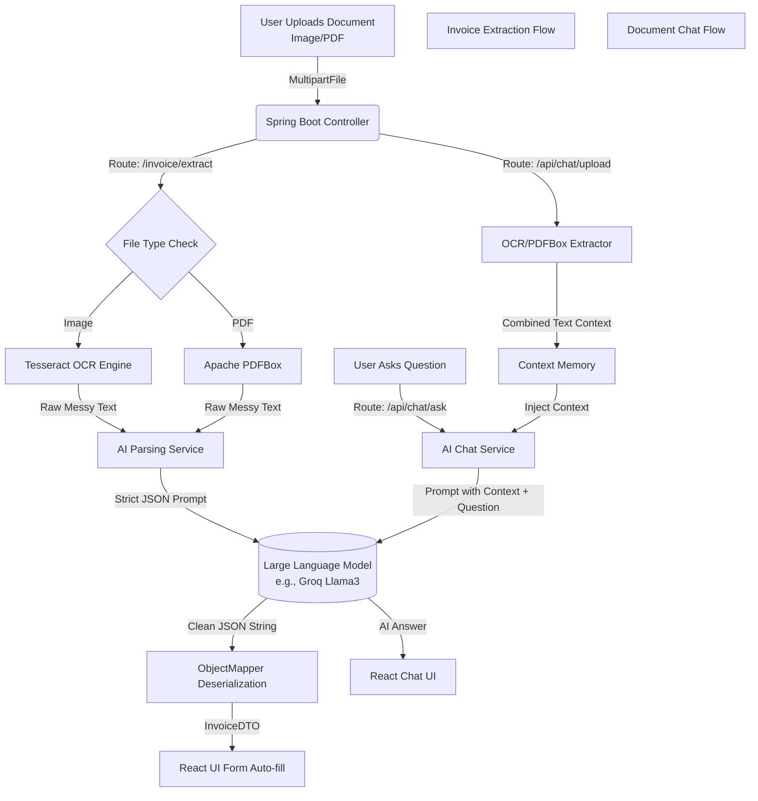
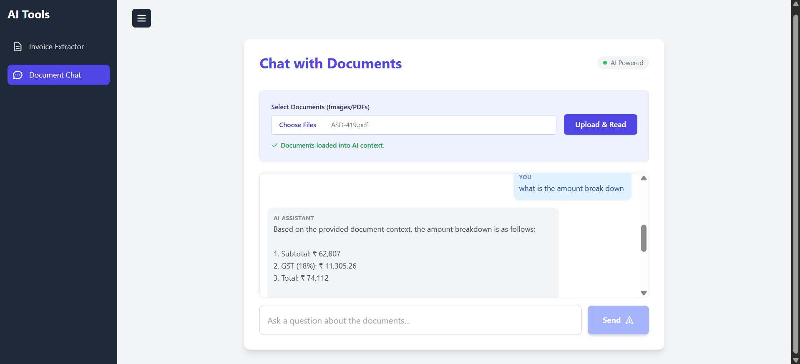

# Smart AI Document System

This project is an intelligent document processing application built with Spring Boot and React. It can extract raw text from documents (images/PDFs), use AI to parse that text into structured JSON data, and even allow users to have a conversation with their uploaded documents.

## System Architecture Flow

Here is a high-level overview of how data flows through the system:



## Features

- **Multi-Format Document Processing**: Upload and process both PDF and image files (`.png`, `.jpg`, etc.).
- **Dual OCR & Text Extraction**:
    - Uses **Tesseract OCR** for image-based text extraction.
    - Uses **Apache PDFBox** for direct text extraction from text-based PDFs.
- **AI-Powered Data Structuring**: Leverages a Large Language Model (LLM) via Spring AI to convert messy OCR text into a clean, structured JSON format.
- **Chat with Documents**: Upload multiple documents and ask questions about their content in a conversational UI.
- **Unified Frontend**: A modern, single-page application built with React and Tailwind CSS, featuring a collapsible navigation panel to switch between tools seamlessly.

---

## Screenshots

### Document Chat Interface




---

## Technology Stack

### Backend
- **Java 21**: Core programming language.
- **Spring Boot 3**: Framework for building the backend application.
- **Spring Web**: For creating REST APIs.
- **Spring AI**: To connect with and prompt Large Language Models (like Groq's Llama3 or OpenAI's GPT).
- **Tess4J**: Java wrapper for the Tesseract OCR engine.
- **Apache PDFBox**: For extracting text directly from PDF files.
- **Maven**: For dependency management and building the project.

### Frontend
- **React**: For building the user interface components.
- **Babel (Standalone)**: To transpile JSX directly in the browser for this demo project.
- **Tailwind CSS**: For modern, utility-first styling.
- **JavaScript (ES6+)**: For UI logic and interactivity.

---

## How It Was Built: Our Journey

This project was built iteratively, phase by phase, with each step resulting in a functional output.

### Phase 1: The OCR Foundation
The initial goal was to simply extract raw text from a document.
1.  **Package Structure**: We laid out a standard Spring Boot package structure (`controller`, `service`, `dto`).
2.  **OCR Service**: An `OCRService` was created using `Tess4J`. We initially configured it to handle both images and PDFs by passing the file directly to Tesseract.
3.  **API Endpoint**: A simple `POST /ocr/extract` endpoint was created to accept a file and return the raw text.
4.  **Configuration Challenges**: We ran into several startup errors due to auto-configuration of dependencies like `spring-data-jpa` and `spring-ai`. We resolved these by explicitly excluding `DataSourceAutoConfiguration` and `PgVectorStoreAutoConfiguration` in `application.properties`, as a database was not needed for this phase.

### Phase 2: AI Structured Extraction
The raw text was messy. The goal of this phase was to convert it into clean JSON.
1.  **DTO Creation**: An `InvoiceDTO` was created to define the desired JSON structure.
2.  **AI Service**: An `AIParsingService` was built using Spring AI's `ChatClient`. We crafted a prompt to instruct the AI to extract specific fields from the OCR text.
3.  **Connecting to Groq**: The initial setup pointed to OpenAI, causing an API key mismatch. We corrected this by setting the `spring.ai.openai.base-url` to Groq's endpoint and specifying a compatible model (`llama3-70b-8192`).
4.  **New Controller**: A dedicated `InvoiceController` was created with a `POST /invoice/extract` endpoint that chained the two services: `OCRService` -> `AIParsingService`.

### Phase 3: Making the AI Reliable
AI responses can be unpredictable. This phase was about making the system robust.
1.  **Prompt Engineering**: We refined the prompt with stricter rules: "Return ONLY valid JSON", "If value not found, return null", and provided a clear example.
2.  **Defensive Coding**: A `cleanJson` method was added to strip out any conversational text or markdown the AI might add around the JSON block.
3.  **Logging**: We added `Slf4j` logging to see the exact text sent to the AI and the raw response received, making debugging much easier.

### Phase 4 & 5: Building the Frontend
With a solid backend, we focused on the user experience.
1.  **Initial UI**: We started with a simple `index.html` file using React from a CDN to quickly build a form that could upload a file and auto-fill with the extracted data.
2.  **Chat with Documents**: We expanded the backend with a `DocumentChatController` that could process multiple documents into a single text "context" and answer questions based on it. A separate `chat.html` was created for this.
3.  **Unified Production UI**: Finally, we consolidated everything into a single, professional frontend.
    - A `main.html` now serves as the application shell.
    - A collapsible sidebar was added for navigation.
    - The React components for the "Extractor" and "Chat" tools were moved into a single `app.js` file, and JavaScript logic was used to toggle their visibility, creating a seamless single-page application (SPA) experience.

---

## How to Run the Project

### Prerequisites
1.  **JDK 21**: Make sure you have Java 21 installed.
2.  **Maven**: The project uses Maven for its build.
3.  **Tesseract OCR**: You must have Tesseract installed on your system.
    - You can download it from the [official Tesseract GitHub page](https://github.com/tesseract-ocr/tesseract).
    - **Crucially**, ensure you also download the **English language data file (`eng.traineddata`)** and place it in the `tessdata` directory of your Tesseract installation (e.g., `C:\Program Files\Tesseract-OCR\tessdata`).

### Configuration
1.  Open the `src/main/resources/application.properties` file.
2.  Replace the placeholder API key with your own key from Groq, OpenAI, or another compatible provider.

    ```properties
    # For Groq
    spring.ai.openai.base-url=https://api.groq.com/openai
    spring.ai.openai.api-key=YOUR_GROQ_API_KEY
    spring.ai.openai.chat.options.model=llama3-70b-8192

    # For OpenAI (if you switch)
    # spring.ai.openai.api-key=YOUR_OPENAI_API_KEY
    ```

### Running the Application
1.  Open a terminal in the root directory of the project.
2.  Run the following Maven command:
    ```sh
    mvn spring-boot:run
    ```
3.  Once the application has started, open your web browser and navigate to:
    **`http://localhost:8080/`**

You can now use the full application!